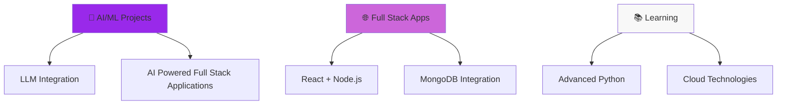

#  Hi, I'm Rohit Kumar Singh

<div align="center">
  
  [](https://git.io/typing-svg)
  
  
  
</div>

---

## 🚀 **About Me**


```python
class RohitKumarSingh:
    def __init__(self):
        self.name = "Rohit Kumar Singh"
        self.role = "Full Stack Developer"
        self.language_spoken = ["Python", "JavaScript", "C++", "C"]
        self.code = {
            "frontend": ["HTML", "CSS", "Tailwind", "React"],
            "backend": ["Node.js", "Express", "Python"],
            "database": ["MongoDB", "Neon"],
            "tools": ["VS Code", "Git", "npm", "Blender"]
        }
        self.current_focus = "LLMs & Conversational AI"
        
    def say_hi(self):
        print("Thanks for dropping by! Let's build something amazing together!")

me = RohitKumarSingh()
me.say_hi()
```

---

## 🛠️ **Tech Arsenal**

<div align="center">

### **Languages & Frameworks**
<p>
  
</p>

### **Tools & Platforms**
<p>
  
</p>

</div>

---

## 📊 **GitHub Analytics**

<div align="center">
  
  
  
  
</div>

<div align="center">
  
  [](https://git.io/streak-stats)
  
</div>

<div align="center">
  
  <a href="https://github.com/0xRoS-200">
    
  </a>
  
</div>

---

## 🏆 **Achievements & Trophies**

<div align="center">
  
  [](https://github.com/ryo-ma/github-profile-trophy)
  
</div>

---

## 🔥 **What I'm Working On**

<div align="center">



</div>

---

## 📈 **Contribution Graph**

<div align="center">
  
  [](https://github.com/ashutosh00710/github-readme-activity-graph)
  
</div>

---

## 🎯 **Current Goals**

<details>
<summary>🚀 <b>Click to expand my 2024 goals!</b></summary>

- [ ] 🤖 Build an advanced chatbot with multiple LLM integrations
- [ ] 🌐 Create a full-stack AI-powered web application
- [ ] 📚 Master advanced React patterns and state management
- [ ] ☁️ Learn cloud deployment (AWS/GCP)
- [ ] 🔥 Contribute to 10+ open source projects
- [ ] 📝 Write technical blogs about AI/ML
- [ ] 🎯 Build a personal AI assistant

</details>

---

## 📚 **Latest Blog Posts**

<!-- BLOG-POST-LIST:START -->
<!-- This section can be auto-updated with your latest blog posts -->
🔜 **Coming Soon:** Technical blogs about LLMs and Full Stack Development!
<!-- BLOG-POST-LIST:END -->

---

## 🌟 **Fun Facts**

<div align="center">

| 💡 Did you know? |
|:----------------:|
| I debug with `console.log()` and I'm not ashamed! 😄 |
| My code works perfectly... until someone else tries to run it 🤷‍♂️ |
| I speak fluent Python, but still learning human languages 🐍 |
| Coffee is my debugging fluid ☕ |

</div>

---

## 🤝 **Let's Connect & Collaborate**

<div align="center">

### **Ready to build something amazing together?**

<p>
  <a href="mailto:official.rohitsingh22@gmail.com">
    
  </a>
  <a href="https://linkedin.com/in/yourprofile](https://www.linkedin.com/in/rohit-kumar-singh-82b56b307/">
    
  </a>
  <a href="https://twitter.com/CodebyRoS](https://x.com/CodebyRoS">
    
  </a>
</p>

### **Open for:**
🚀 **Full Stack Development** | 🤖 **AI/ML Projects** | 🌐 **Web Applications** | 📊 **Data Engineering**


</div>

---

<div align="center">
  
  ### **"Code is like humor. When you have to explain it, it's bad."** – Cory House
  
  
  
  ---
  
  <sub>⭐ **Star some repositories if you find them interesting!** ⭐</sub>
  
  
  
</div>
